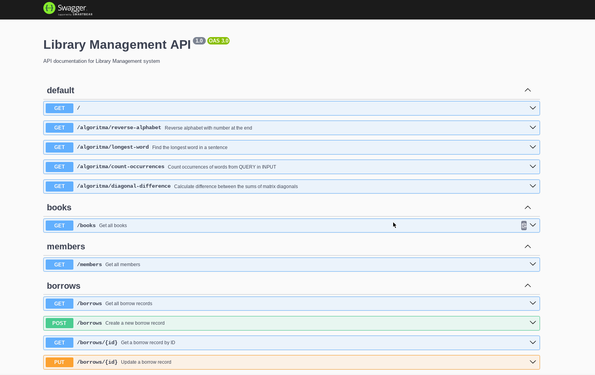

# Library Management System

## Overview

This project is a full-stack web application designed to manage a library's operations, including book borrowing, returning, and member management. The backend is built with NestJS, a progressive Node.js framework, and utilizes TypeORM for database interactions. The frontend is developed using React, with Tailwind CSS for styling. The system also implements logic for managing member penalties for late returns, with configurable grace periods and penalties.

### Key features include:
- CRUD Operations: Manage books, members, and borrowing records.
- Penalty Management: Automatically apply penalties to members for late book returns, configurable through environment variables.
- Real-time Data Display: Frontend dashboard showing the status of books and members.
- API Documentation: Integrated with Swagger to provide interactive API documentation.

### Technologies Used:

- Backend: NestJS, TypeORM
- Frontend: React, Tailwind CSS
- Database: MySQL
- API Documentation: Swagger

## Swagger


## Dashboard


## Requirements
- Node.js (>=14.x)
- MySQL (>=5.7)
- Docker (optional, for containerized setup)


## Installation Backend

### 1. Clone the repository

```bash
 git clone https://github.com/putra-asmarjoe/BookManager.git
 cd BookManager
```

### 2. Install dependencies 

```bash
npm install
```

### 3. Set up database
Create the MySQL database `librarybook` and grant necessary permissions to the user specified in your .env file (MYSQL_USER).


### 4. Set up environment variables
#### Create a `.env` file in the root directory with the following variables:

```bash
touch .env
```

```makefile
PORT=3881
DB_HOST=localhost
DB_PORT=3307
DB_USERNAME=root
DB_PASSWORD=yourdbpassword
DB_DATABASE=librarybook

PENALTY_PERIOD_DAYS=3
OVERDUE_PERIOD_DAYS=7
MAX_MEMBER_BORROW=2

WL_ORIGIN=http://localhost:3880
```
Make sure to adjust DB_USERNAME and DB_PASSWORD to match your MySQL credentials.

## Usage

### Manual

```bash
npm start
```


## Installation Frontend

### 1. Move to frontend directory

```bash
 cd dashboard/
```

### 2. Install dependencies 

```bash
npm install
```

### 3. Set up environment variables
#### Create a `.env` file in the root directory with the following variables:

```bash
touch .env
```

```makefile
PORT=3880
REACT_APP_API_HOST=http://127.0.0.1:3881/
```
Make sure to adjust PORT of your backend

## Usage

### Manual

```bash
npm start
```

### Run with Docker Compose
 #### Alternatively, you can use Docker Compose to run in a single command:
 ```bash
 docker-compose -f docker-compose.yml up -d --build
 ```

## Access the Application
```
Swagger Api: http://127.0.0.1:3881/api (Included ALGORITMA test)
Dashboard App: http://127.0.0.1:3880/
```


## License

This project is licensed under the MIT License. See the [LICENSE](LICENSE) file for details.
